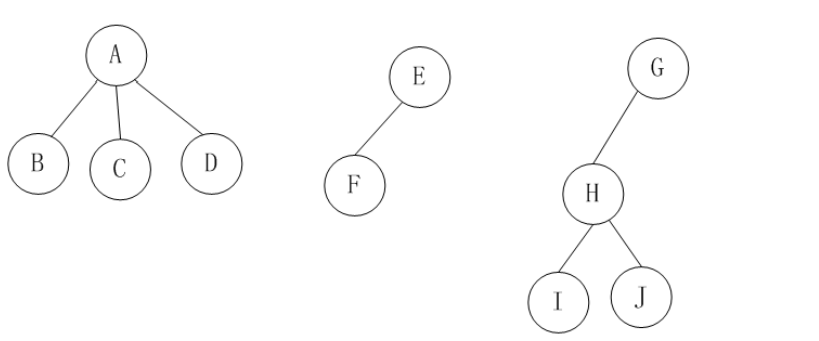
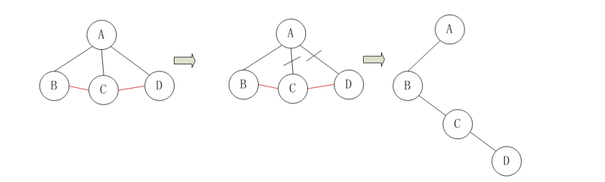
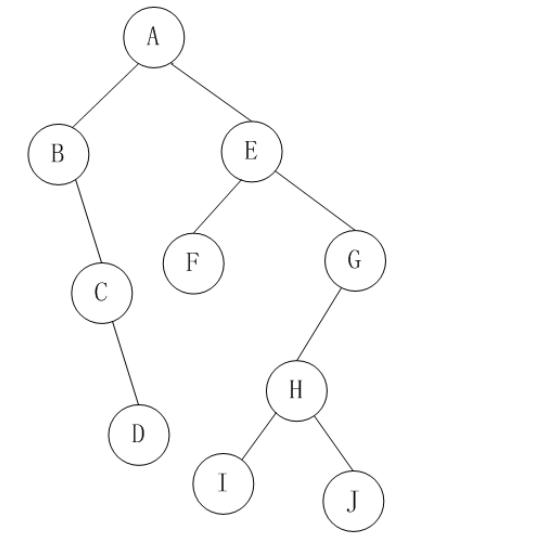

# 临时记录-待分类

## 软件维护的四种类型

1. **改正性维护（Corrective Maintenance）**
   - 修复软件在运行中发现的错误或缺陷。
   - 关键词：**纠错、修复缺陷**。
2. **适应性维护（Adaptive Maintenance）** ✅
   - 当**运行环境发生变化**（软硬件、操作系统、数据库版本等），为了保证软件继续运行而进行的修改。
   - 关键词：**适应环境变化**。
3. **完善性维护（Perfective / Improvement Maintenance）**
   - 在用户需求变化时，为了**改进性能或增强功能**而进行的修改。
   - 关键词：**扩展功能、改善性能**。
4. **预防性维护（Preventive Maintenance）**
   - 为了**提高软件可维护性、预防未来潜在问题**，提前修改软件。
   - 关键词：**未雨绸缪、提高可靠性**。

### 📌 总结口诀

- **改正性：修 bug**
- **适应性：换环境**
- **完善性：加功能/优化提升性能**
- **预防性：防未来**

----

## 网络分层模型与设备对应

### ① 五层协议模型

1. **应用层**
   - 协议：HTTP、FTP、SMTP、DNS
   - 设备：应用软件
2. **传输层**
   - 协议：TCP、UDP
   - 设备：防火墙（**部分功能涉及传输层**端口控制）。**无专属硬件**
3. **网络层**
   - 协议：IP、ICMP、ARP、RIP、OSPF
   - 设备：**路由器、防火墙（主要功能）、三层交换机**
4. **数据链路层**
   - 协议：以太网（Ethernet）、PPP、HDLC
   - 设备：**交换机、网桥**
5. **物理层**
   - 信号传输，比特流
   - 设备：**中继器、集线器、网线、光纤、双绞线、网卡（部分）**

注意： **以太网交换机通常指二层交换机**，它工作在链路层

------

### ② 七层 OSI 模型（对照）

| OSI 七层   | 五层模型对应 | 协议/功能            | 设备                           |
| ---------- | ------------ | -------------------- | ------------------------------ |
| 应用层     | 应用层       | HTTP、FTP、DNS、SMTP | 应用软件                       |
| 表示层     | 应用层       | 编码、加密、压缩     | 软件库                         |
| 会话层     | 应用层       | 建立/维护/管理会话   | 软件库                         |
| 传输层     | 传输层       | TCP、UDP             | 防火墙（**部分**）             |
| 网络层     | 网络层       | IP、ICMP、路由协议   | 路由器、防火墙（**主要功能**） |
| 数据链路层 | 数据链路层   | 以太网、PPP、帧      | 交换机、网桥                   |
| 物理层     | 物理层       | 比特流、物理接口     | 集线器、中继器、网线           |

------

### ③ 总结口诀

- **物理层**：集线器、中继器（传电信号）
- **链路层**：交换机、网桥（管帧转发）
- **网络层**：路由器、防火墙（管IP转发）
- **传输层**：端口防火墙（控制TCP/UDP端口）
- **应用层**：应用协议（HTTP、DNS、邮件等）

👉 口诀：
 **“物理靠电线，链路靠交换，网络靠路由，传输靠端口，应用靠协议。”**

## 结构化

**结构化分析（SA）**：自顶向下逐步分解，侧重功能。

**结构化设计（SD）**：模块化、低耦合高内聚。

**结构化程序设计（SP）**：三种基本控制结构（顺序、选择、循环）

---

## 树与二叉树常考公式速查表

① 树的基本性质

1. 一棵有 $n$ 个结点的树有 **$n-1$ 条边**。

2. 树的度 = 各结点度的最大值。

3. 设 $n_i$ 表示度为 $i$ 的结点数，$n$ 表示总结点数：

   n=n0+n1+n2+⋯+nmn = n_0 + n_1 + n_2 + \dots + n_mn=n0+n1+n2+⋯+nm

------

### ② 叶子结点数公式（树）

设树的度为 $m$，$n_0$ 表示叶子结点数，则：

n0=(n2+2n3+3n4+⋯+(m−1)nm)+1n_0 = (n_2 + 2n_3 + 3n_4 + \dots + (m-1)n_m) + 1n0=(n2+2n3+3n4+⋯+(m−1)nm)+1

**口诀**：叶子数 = (度 ≥ 2 的结点超出部分和) + 1

------

### ③ 二叉树的性质

1. **结点数关系**
    对任意二叉树：

   $n0=n2+1$

   （叶子结点数 = 度为 2 的结点数 + 1）

2. **第 i 层最多结点数**

   ${MaxNodes}(i) = 2^{i-1}$

3. **深度为 k 的二叉树最多结点数**

   ${MaxNodes} = 2^k - 1$

4. **有 n 个结点的完全二叉树深度**

   k=⌊log2^n^⌋+1

5. **满二叉树**

   - 叶子结点数 = 内部结点数 + 1
   - 总结点数 $n = 2n_0 - 1$

------

### ④ 树与二叉树的转换

1. 任意树 → 二叉树 （**左孩子、右兄弟**）：
   - 兄弟相连 → 加横线
   - 只留长子 → 加竖线
   - 删除其他连线
2. 二叉树 → 树：
   - 把左孩子当长子
   - 把右孩子当兄弟

该森林有3课子树：

将此森林转换成二叉树，这里只需要转换第1棵子树，子树2和子树3本身已经是二叉树了。子树1转换成二叉树的过程是：1、在所有兄弟结点之间加一条线。2、对树中的每个结点，只保留它与第一个孩子结点之间的连线，删除它与其它孩子结点之间的连线。3、该树的孩子结点转化为这个颗二叉树的左子树，兄弟结点转换为二叉树的右孩子结点。

最终的转换结果如图：

左子树的节点数目=n1-1

右子树的节点数目=n2+n3

------

### 📖 例题速算

例：一棵二叉树有 20 个叶子结点，问度为 2 的结点有多少个？

- 用公式：$n_0 = n_2 + 1$
- $n_2 = 20 - 1 = 19$ ✅

------

✅ 总结口诀：

- **树：叶子 = 度≥2的超额 + 1**
- **二叉树：叶子 = 度2 + 1**
- **满二叉树：总结点 = 2×叶子 - 1**

### 📖 举个例子

题目里说：一棵树

- 度为 4 的结点：5 个
- 度为 3 的结点：8 个
- 度为 2 的结点：6 个
- 度为 1 的结点：10 个

用公式算：

$n0=(n2+2n3+3n4)+1=(6+2×8+3×5)+1=(6+16+15)+1=38$

结果叶子数 = 38。

------

### ✅ 总结理解

- **度 = 1**：不影响叶子数:  `(1-1)*10 = 0`
- **度 ≥ 2**：多出的 $(k-1)$ 个孩子，会减少 $(k-1)$ 个叶子 → 所以要加进公式
- **最后 +1**：树整体结构补偿

👉 所以口诀才写成：
 **叶子 = （度 ≥ 2 的超额总和） + 1**

## 各类测试和主要发现的问题阶段

1. **单元测试**
   - 检查：模块是否实现了 **详细设计**
   - 发现：实现代码与详细设计不符的问题
2. **集成测试**
   - 检查：模块之间接口、交互是否满足 **概要设计**
   - 发现：模块接口、数据流、控制流的问题
3. **系统测试**
   - 检查：整个系统是否满足 **需求分析**
   - 发现：需求是否实现正确、完整
4. **验收测试**
   - 检查：系统是否满足用户需求（用户验收）

---

## 瀑布模型 (Waterfall Model)

- 瀑布模型是以**文档为驱动**的模型，适合**需求明确**的软件项目的模型，

- **优点:**
  - **容易理解**
  - **管理成本低**
- **缺点:**
  - 缺乏灵活性
  - 难以适应需求的变化（如果软件在后期出现需求变化，整个系统需要从头开始）

✅ 口诀：

- **瀑布模型：文档驱动、阶段顺序、缺乏灵活性**
- **原型模型：用户参与，需求明确**
- **螺旋模型：风险驱动，迭代开发**
- **敏捷方法：强调沟通，应对变化**

---

## 十大排序算法

排序规则、时空复杂度、稳定性

