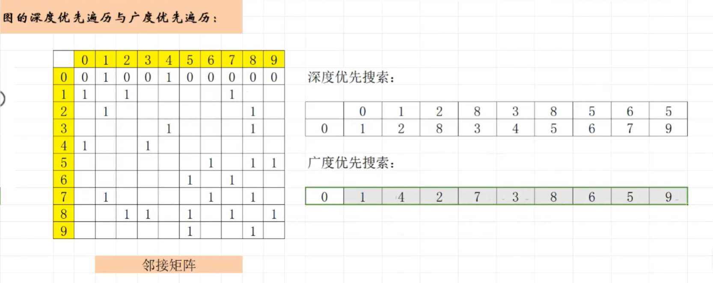
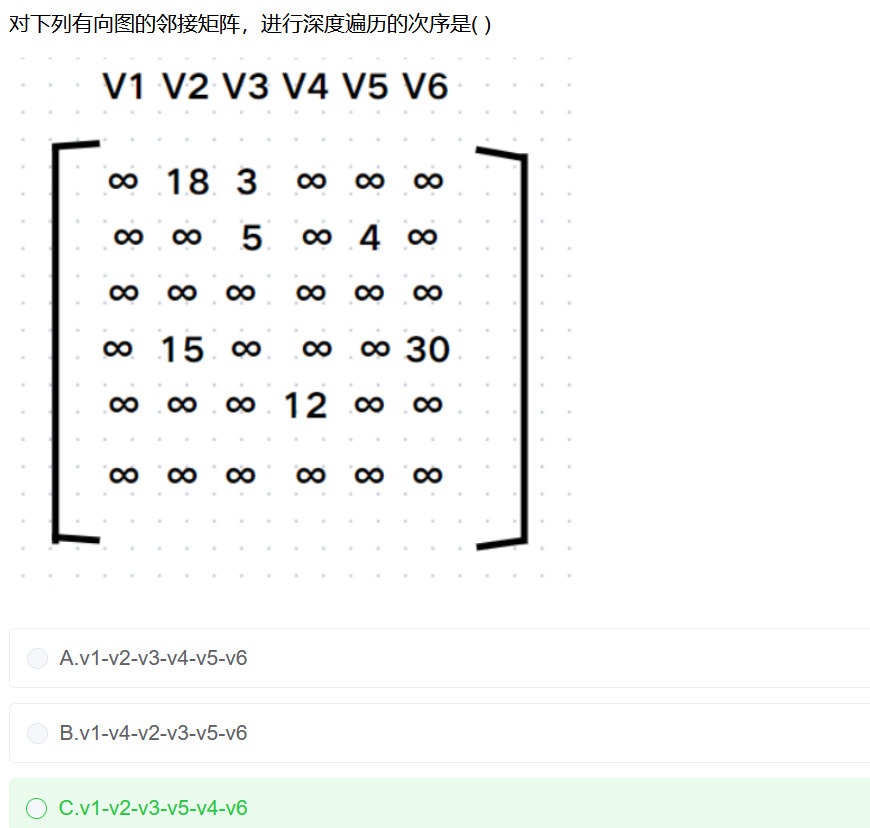

# 图的遍历

## 自学总结

1. 不管图是否有向，得到的深度优先的序列可能是不唯一的 

2. 不管是无向图还是有向图，得到的邻接矩阵都是唯一的，通过邻接矩阵得到的深度优先遍历序列是唯一的

## 有向图

### 有向图的深度遍历

### 有向图的广度遍历

---

## 无向图

### 无向图的深度遍历

### 无向图的广度遍历

---

## 邻接矩阵

### 深度遍历

1. 从第1个节点开始，找到第1行遇到的第一个非0的节点，箭头连接，如1->3
2. 然后从3开始,找第3行的开始遇到的节点，比如遇到的第一个是5,于是得到1->3->5
3. 继续重复上面的操作，从第5行开始找，如果第5行全是0或者第5行遇到的所有非0的节点都被找到过，那么向箭头左边回退，得到3,继续找第3行遇到的未曾找到的节点，比如次时找到了2,于是得到的序列是1->3->5->4
4. 重复上面的序列，直到已找到的序列数目=总节点-1时，把还没找到的那个序列直接放在末尾，就是深度优先遍历的序列

## 广度遍历

这个很简单，

1. 从第1个节点1开始，在第1行遇到了3和5，则得到 1->3->5
2. 1已经找过了，按照上面的序列开始找第3行，假设第3行是2和4,那么得到序列1->3->5->2->4,此时发现序列的长度已经等于所有节点数，那么广度遍历序列遍历完成。
3. 如果3找完之后，发现还有序列没找完，继续从3后面的箭头执行的行开始5找
4. 重复上面的操作。直到所有的节点都被遍历完

---

[ 2020年软件设计师考试上午真题](https://ebook.qicoder.com/%E8%BD%AF%E4%BB%B6%E8%AE%BE%E8%AE%A1%E5%B8%88/notes/2020%E5%B9%B4%E8%BD%AF%E4%BB%B6%E8%AE%BE%E8%AE%A1%E5%B8%88%E8%80%83%E8%AF%95%E4%B8%8A%E5%8D%88%E7%9C%9F%E9%A2%98%EF%BC%88%E4%B8%93%E4%B8%9A%E8%A7%A3%E6%9E%90+%E5%8F%82%E8%80%83%E7%AD%94%E6%A1%88%EF%BC%89.html#%E7%AC%AC-49-%E9%A2%98)

某有向图如下所示，从顶点v1出发对其进行深度优先遍历，可能得到的遍历序列是（**D**）; 从顶点v1出发对其进行广度优先遍历，可能得到的遍历序列是（ **B**）。

①v1 v2v3 v4 v5

②v1 v3 v4v5v2

③v1 v3v2v4 v5

④v1 v2v4v5 v3

> - (A) ①②③
> - (B) ①③④
> - (C) ①②④
> - (D) ②③④
>
> - (A) ①②
> - (B) ①③
> - (C) ②③
> - (D) ③④

---

[数据结构与算法：基于邻接矩阵的图的深度优先遍历和广度优先遍历](https://www.bilibili.com/video/BV1D64y1K7Xv/?spm_id_from=333.337.search-card.all.click&vd_source=388f01bb44f002e4de4c1a3c6ceb7302)

---

---

有向图G 具有n个顶点、e条弧，采用邻接表存储，则完成深度和广度优先遍历的时间复杂度分别为 **O(n+e)** 和 **O(n+e)**

n个结点、e条边的无向图进行深度优先遍历

- 在邻接表中，时间复杂度是**O(n+e)**
- 在邻接矩阵中，算法需要遍历邻接矩阵×n个点，所以时间复杂度是**O(n×n)**。

---

**超码（Superkey）**是能够唯一标识关系中元组（即一行数据）的一个或多个属性的集合。

简单来说，如果一个属性集合是超码，那么这个集合中的值可以唯一地确定表中的每一行。

### 超码的特点

1. **唯一性**：超码的值在整个关系中是唯一的，不会有两行具有相同的超码值。
2. **冗余性**：超码可能包含冗余属性。例如，如果属性集合 {A, B} 是超码，那么 {A, B, C} 也是超码，因为 {A, B} 已经足以唯一标识行，添加属性 C 并不会改变其唯一性。

------

### 超码、候选码和主码的关系

理解超码的关键是把它和另外两个重要的概念——**候选码**和**主码**——进行比较。

- **超码 (Superkey)**：任何能够唯一标识行的属性集合，**可能包含多余的属性**。
  - **例子**：在一个学生表中，如果 {学号} 是超码，那么 {学号, 姓名}、{学号, 姓名, 班级} 也都是超码。
- **候选码 (Candidate Key)**：**最小的超码**，它不包含任何可以被移除的、且不影响唯一性的属性。一个关系可以有多个候选码。
  - **例子**：如果 {学号} 和 {身份证号} 都能唯一标识学生，并且它们都是最小的（不能再移除属性），那么 {学号} 和 {身份证号} 都是候选码。
- **主码 (Primary Key)**：数据库设计者从**多个候选码中指定的一个**，作为关系的主标识符。
  - **例子**：在上面的例子中，我们通常会选择 {学号} 作为主码，因为它通常更简洁。

### 总结

- 所有**候选码**都是**超码**。
- **主码**是**候选码**的一个特例。
- 所有**超码**不一定是**候选码**，因为它可能不是最小的。
