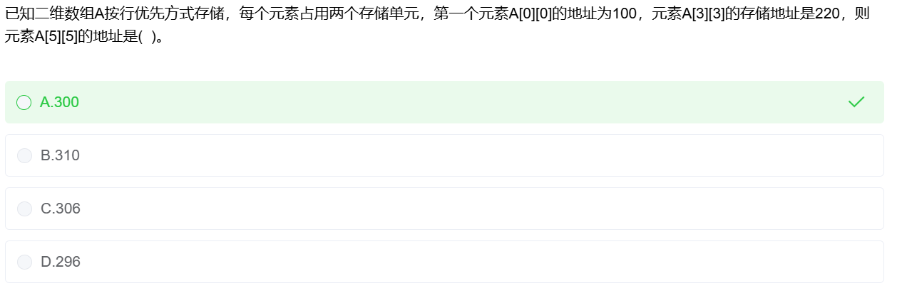
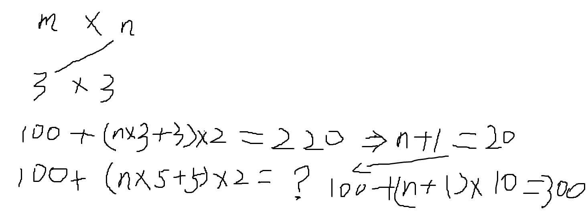

# 二维数组地址计算方法

[一学就懂视频](https://www.bilibili.com/video/BV1PN411U7Yn/?spm_id_from=333.337.search-card.all.click&vd_source=388f01bb44f002e4de4c1a3c6ceb7302)

## 按行存储计算方式

## 按列存储计算方式

把负的对角线换成正的对角线即可

