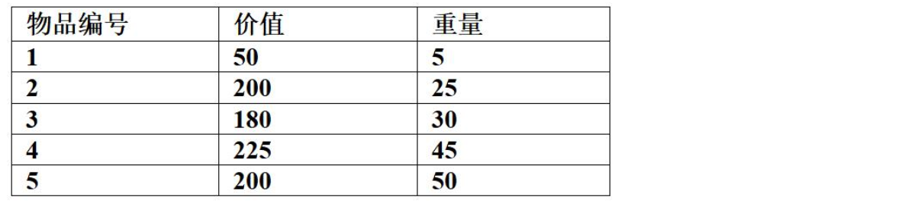

# 背包问题

> 贪心法
>
> **不能**保证对所有背包问题都取得最优解
>
> 尤其对0-1背包问题，它只能得到局部最优解，而无法保证全局最优解。
>
> 贪心法在部分背包问题中 **一定能得到最优解**

## 贪心法解决部分背包问题（也称分数背包问题）的核心策略

> 1. 计算每种物品的单位重量价值（总价值/总重量）
>
> 2. 并按此降序排列所有物品。然后，依次将价值最高的物品放入背包，直到背包已满
> 3. 对于最后一个无法完整放入的物品，则**按比例截取一部分放入**，**直到背包容量恰好用完为止**
>
> 所以， 贪心法在部分背包问题中 **一定能得到最优解**

---

考虑下述背包问题的实例。有5件物品，背包容量为100，每件物品的价值和重量如下所示，并已经按照物品的单位重量价值从大到小排好序。根据物品单位重量价值大优先的策略装入背包中，则采用了  ( 54 )  设计策略。考虑0/1背包问题(每件物品或者全部装入背包或者不装入背包)和部分背包问题(物品可以部分装入背包)，求解该实例得到的最大价值分别为  ( 55 ) 。

特别注意：题干明确规定**根据物品单位重量价值大优先的策略装入背包中**，所以要求使用**贪心**策略求最大价值，切勿使用常规思维即用动态规划去0/1背包问题，另外注意部分背包**最后1个物品放不下的时候按照比例把背包放满**

## 1️⃣ 部分背包问题（物品可分割）

- 先装物品1：重量 5，剩余 95，价值 = 50
- 装物品2：重量 25，剩余 70，价值 = 250
- 装物品3：重量 30，剩余 40，价值 = 430
- 装物品4：重量 45，但背包只剩 40，装 40/45 = 0.888…
  - 价值 = 225 × (40/45) ≈ 200
- 总价值 = 50 + 200 + 180 + 200 = **630**

✅ 部分背包最大价值 = **630**

------

## 2️⃣ 0/1 背包问题（物品不可分割）

同样按单位价值贪心：

- 装物品1：重量 5，剩余 95，价值 = 50
- 装物品2：重量 25，剩余 70，价值 = 250
- 装物品3：重量 30，剩余 40，价值 = 430
- 下一步遇到物品4：重量 45 > 剩余 40，放不下 ❌
- 物品5：重量 50 > 剩余 40，放不下 ❌

结束。

✅ 0/1 背包最大价值 = **430**

------

## 🎯 最终结论

- **设计策略**：单位价值优先（贪心）
- **部分背包最大价值** = **630**
- **0/1 背包最大价值** = **430**
