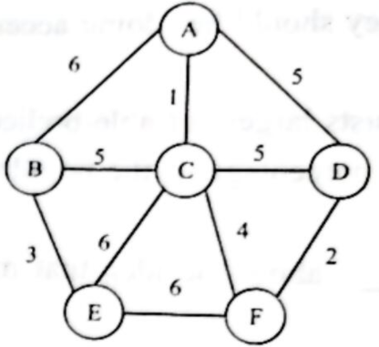
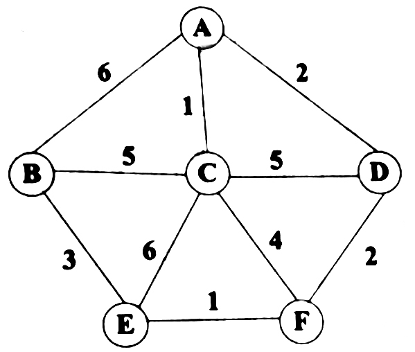

# 贪心法求最小生成树

**Prim 算法** 和 **Kruskal 算法** 求最小生成树 (MST)

## 1️⃣ Prim 算法（从 A 开始）

Prim 思路：从某个顶点开始，每次选择 **当前生成树能连到的最小权值边**。

1. 从 A 出发，最小边 A—C(1) → 选中。
    当前树：{A, C}
2. 从 {A,C} 出发，最小边 C—F(4) → 选中。
    当前树：{A, C, F}
3. 从 {A,C,F} 出发，最小边 F—D(2) → 选中。
    当前树：{A, C, F, D}
4. 从 {A,C,F,D} 出发，最小边 B—E(3) 不行（不连通），那就取 D/F 以外的最小边 → B—E 要等 B/E 进来。此时 C—B(5)、A—B(6)，更小的是 B—E(3) 但不连，先连 B—E？不行。我们看连通性 → {A,C,F,D} 外的顶点是 B,E，最小可连边是 B—E(3)? 不行，因为B,E都不在树里。下一个候选是 C—B(5) → 选中。
    当前树：{A, C, F, D, B}
5. 还差 E，连通外部最小边：B—E(3) → 选中。
    当前树：{A, C, F, D, B, E}

✅ Prim MST 边集合：
 A—C(1), C—F(4), F—D(2), C—B(5), B—E(3)
 总代价 = 1+4+2+5+3 = **15**

------

## 2️⃣ Kruskal 算法

Kruskal 思路：把所有边按权重从小到大排，依次选择不会构成环的边。

1. A—C(1) → 选
2. D—F(2) → 选
3. B—E(3) → 选
4. C—F(4) → 选
5. 下一条边是 A—D(5)，但会不会形成环？
   - 当前树有 A—C、C—F、F—D → A 已和 D 联通 → A—D 会成环 ❌ 跳过
6. B—C(5) → 选（不成环）

此时 5 条边选完，6 个顶点都联通。

✅ Kruskal MST 边集合：
 A—C(1), D—F(2), B—E(3), C—F(4), B—C(5)
 总代价 = 1+2+3+4+5 = **15**

---

## 3️⃣Dijkstra算法

从A到F的最小路径，就是从A开始，到达F，形成一条通路，得到的最短路径

### 202211

采用Dijkstra算法求解下图A点到E点的最短路径，采用的算法设计策略是(64)，该最短路径的长度是(65)。

ACF = 1+ 4 = 5

