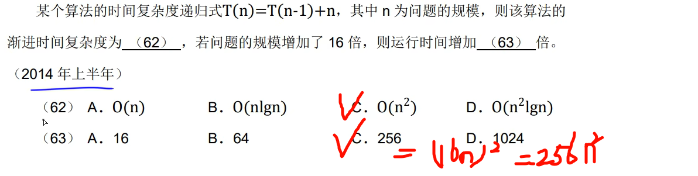

# [递归式主方法](https://www.bilibili.com/video/BV1jY411b73f/?p=12&share_source=copy_web&vd_source=eade46c3bcc6c5ba098604997dc58944)

## 用主方法求解下列递归式

### (1) T(n) = 9T(n/3) +n

求解：$a = 9, b= 3, log_{b}^{a} = log_{3}^{9} = 2, f(n) = n = n^{2-ε} ,存在ε = 1>0,所以满足（1）,则T(n) = O(n^{2})$

---

### (2) T(n) = T(2n/3) + 1

求解：$a = 1, 1/b = 2/3=>b = 3/2, log_{b}^{a} = logb^{1} = 0, f(n) = 1 = n^{0-ε}$  ,不满足，

所以尝试case 2,

$f(n) =1 =  n^{0} lg^{k} n = (lg^{n} )^{k} ,得到k = 0时满足case 2,所以T(n) = O(1 lgn) = O(lgn)$

---

### (3) T(n) = 3T(n/4) + nlgn

求解：

---

## 真题1

## 真题2

求解：

T(1) = 1

T(2) = T(1) + 2

T(3) = T(2) + 3

T(4) = T(3) + 4

……

T(n-1) = T(n-2) + (n-1)

T(n) = T(n-1) + n

总共递归n次，得到等差数列 n*(n+1)/2 ,保留高阶 $O(n^{2})$

---

## 真题3

求解：

a=2

b=2

f(n) = nlgn

$log_{b}^{a} = log_{2}^{2} = 1$

case 1: $f(n) = nlgn = n^{1-ε}$ ,不满足

case 2: $f(n) = nlgn = n lg^{k} n, 得到k=1, 所以T(n) = O(n lg^{k+1}n) = O(nlg^{2}n)$

---

## 真题4

求解：

a = 6

b = 5

f(n) = n

$log_b^{a} = log_5^{6} = 1.x$

case 1:  f(n) = n = $n^{1.x-ε}, 当ε = 0.x时可以满足，所以T(n) = O(n^{\log_5 6})$

---

## 真题5

求解：

- 算法A：
  - a = 7
  - b = 2
  - $f(n) = n^{2}$
  - $log_{b}^{a} = log_{2}^{7} = 2.x$
  - case 1: 如果存在$ε >0, f(n) = n^{log_{b}^{a}} = n^{log_{2}^{7}} = n^{2.x-ε} = n^{2},所以O(T) = O(n^{})$
- 算法B:
  - a = a
  - b = 4
  - $f(n) = n^{2}$
  - $log_{b}^{a} = log_{4}^{a}$
  - case 1: 如果存在$ ε >0, f(n) = n^{log_{4^{a}-ε}}, 假设满足，T(n) = O(n^{log_{4}^{a}})$
- 要想B的算法渐进地快于算法A，那么$O(n^{log_{4}^{a}}) < O(n^{log2^{7}})$
  - 于是得到$log_{4}^{a} < log2^{7},log_{4}^{a} = (log_{2}^{a})/log_{2}^{4} = log_{2}^{a}/2,于是log_{2}^{a} < 2log_{2}^{7} = log_{2}^{7^{2}} = log_2^{49}, 所以a=48$

---

## 真题6

求解：

- （62）$O(n^{3})$
- （63）max(X) = 63 

## 相关知识

---

---

---

---

