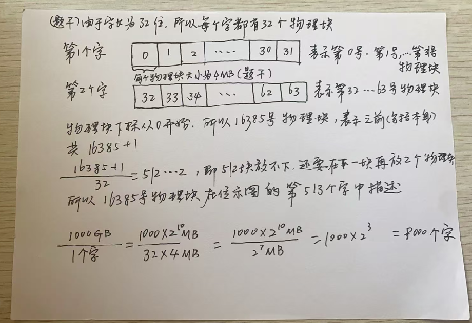

# 位示图

[2021年上半年软设考试上午真题-23题](https://ebook.qicoder.com/%E8%BD%AF%E4%BB%B6%E8%AE%BE%E8%AE%A1%E5%B8%88/notes/2021%E5%B9%B4%E4%B8%8A%E5%8D%8A%E5%B9%B4%E8%BD%AF%E8%AE%BE%E8%80%83%E8%AF%95%E4%B8%8A%E5%8D%88%E7%9C%9F%E9%A2%98.html?h=%E4%BD%8D%E7%A4%BA%E5%9B%BE#%E7%AC%AC-23-%E9%A2%98)

若计算机系统的字长为128位，磁盘的容量为2048GB，物理块的大小为8MB，假设文件管理系统采用位示图(bitmap）法记录该计算机系统磁盘的使用情况，那么位示图的大小需要（**B**）个字

> - (A) 1024
> - (B) 2048
> - (C) 4096
> - (D) 8192

2048\*1024/（128\*8） = 2048\*1024/1024 = 2048

> 经常用到： 128\*8 = 1024

### [201311软设上午真题 第 25 题]((https://ebook.qicoder.com/%E8%BD%AF%E4%BB%B6%E8%AE%BE%E8%AE%A1%E5%B8%88/notes/201311%E8%BD%AF%E8%AE%BE%E4%B8%8A%E5%8D%88%E7%9C%9F%E9%A2%98.html#%E7%AC%AC-25-%E9%A2%98))

​     某文件管理系统采用位示图（bitmap）记录磁盘的使用情况。如果系统的字长为32位，磁盘物理块的大小为4MB，物理块依次编号为：0、1、2、…,位示图字依次编号为：0、1、2、…,那么16385号物理块的使用情况在位示图中的第（**C**）个字中描述；如果磁盘的容量为1000GB，那么位示图需要（**D**）个字来表示。

> - (A) 128
> - (B) 256
> - (C) 513
> - (D) 1024
>
> 
>
> - (A) 1200
> - (B) 3200
> - (C) 6400
> - (D) 8000

