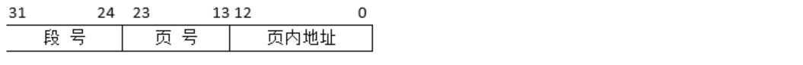

# 段页式存储

假设段页式存储管理系统中的地址结构如下图所示，则系统（ B ）。
 

> - (A) 最多可有256个段，每个段的大小均为2048个页，页的大小为8K/s
> - (B) 最多可有256个段，每个段最大允许有2048个页，页的大小为8K
> - (C) 最多可有512个段，每个段的大小均为1024个页，页的大小为4K
> - (D) 最多可有512个段，每个段最大允许有1024个页，页的大小为4K

最多

最大, 没有平均，**看到平均直接排除**

记忆方式： 段页士今年**多大**了？

常识： 

- 2^13^ = 2^10^ * 2^3^ = 1K * 8 = 8K
- 2^20^ = 2^10^ * 2^10^ = 1k * 2^10^ = 1M
- 2^30^ = 1G 

---

| 存储方式   | 地址结构 | page number 作用 | offset 含义       | 特点                 |
| ---------- | -------- | ---------------- | ----------------- | -------------------- |
| 分页存储   | [ 页号   | 页内地址 ]       | 查页表 → 物理块号 | 页内位置             |
| 分段存储   | [ 段号   | 段内偏移 ]       | 定位段表 → 找基址 | 段内位置             |
| 段页式存储 | [ 段号   | 页号             | 页内地址 ]        | 段表 → 页表 → 物理块 |

