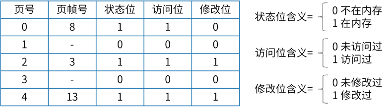

# 页式存储与页面置换

[进程P有5个页面，页号为0-4，页面变换表及状态位、访问位和修改位的含义如下图所示，若系统给进程P分配了3个存储块，当访问的页面3不在内存时，应该淘汰表中页号为（A）的页面](https://ebook.qicoder.com/%E8%BD%AF%E4%BB%B6%E8%AE%BE%E8%AE%A1%E5%B8%88/notes/2021%E5%B9%B4%E4%B8%8A%E5%8D%8A%E5%B9%B4%E8%BD%AF%E8%AE%BE%E8%80%83%E8%AF%95%E4%B8%8A%E5%8D%88%E7%9C%9F%E9%A2%98.html#%E7%AC%AC-24-%E9%A2%98)

> - (A) 0
> - (B) 1
> - (C) 2
> - (D) 4

被淘汰的页面首先必须在内存，也就是在0、2、4页面中进行选择。

修改位为1的正在修改，不能淘汰

优先淘汰访问位为0的页面，此时0、2、4页面访问位都为1，无法判断。
进一步淘汰的是修改位为0的页面，此时符合要求淘汰的是0号页面，选择A选项。

