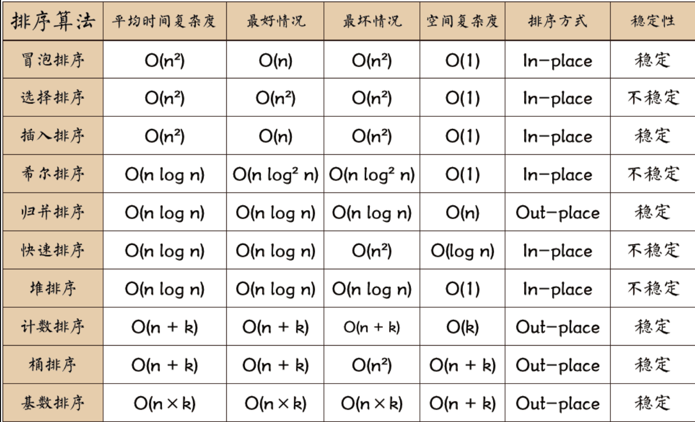

# 十大排序算法

## [1. 冒泡排序 (Bubble Sort)](./bubble-sort.py)

**思想**：
 相邻元素两两比较，若顺序错误就交换。一次遍历会把最大值“冒泡”到最后。重复 n-1 趟，直到有序。

**例子**：数组（20, 40, 30, 10, 60, 50）

1. 第一趟：比较相邻，60 会冒到最后 → （20, 30 ,10, 40, 50, **60**）
2. 第二趟：次大值 50 会冒到倒数第二 → （20, 10,  30, 40, **50, 60**）

**总结**：每趟确定一个最大值，n 个数需要 n-1 趟。最好情况 O(n)，最坏 O(n²)。

```python
def bubble_sort(arr):
    n = len(arr)
    for i in range(n):
        for j in range(0, n-i-1):
            if arr[j] > arr[j+1]:
                arr[j], arr[j+1] = arr[j+1], arr[j]
        print(f"第{i+1}轮排序结果：", arr)          
    return arr

arr = [20, 40, 30, 10, 60, 50]
print("排序前：", arr)
print("排序后：", bubble_sort(arr))
```
------

## 2. 插入排序 (Insertion Sort)

**思想**：
 把待排序数组分成有序区和无序区，每次从无序区取一个数插入到有序区的正确位置。

**例子**：数组（49，38，65，97）

1. 第一步：有序区 (49)，无序区 (38,65,97)
2. 插入 38 → (38,49)，无序区 (65,97)
3. 插入 65 → (38,49,65)，无序区 (97)
4. 插入 97 → (38,49,65,97)

**总结**：适合小规模或基本有序数据，复杂度 O(n²)，稳定。

------

## 3. 希尔排序 (Shell Sort)

**思想**：
 先按 gap 分组（比如 gap=n/2），对每组分别进行插入排序，再逐步缩小 gap，直到 gap=1。

**例子**：数组（49，38，65，97，76，13，27，49），长度 8

1. gap=4 → 分组：[49,76]，[38,13]，[65,27]，[97,49]，分别排序
2. gap=2 → 分组再排序
3. gap=1 → 插入排序，得到整体有序

**总结**：是对插入排序的改进，平均复杂度 O(n^1.3)，不稳定。

------

## 4. 快速排序 (Quick Sort)

**思想**：
 选一个枢轴 pivot，把小于 pivot 的放左边，大于 pivot 的放右边，再递归。

**例子**：数组（49，38，65，97，76，13，27，49）

1. 选 pivot=49，划分成 (38,13,27) + 49 + (65,97,76,49)
2. 左边递归：变成 (13,27,38)
3. 右边递归：变成 (49,65,76,97)
4. 合并： (13,27,38,49,49,65,76,97)

**总结**：平均 O(n log n)，最坏 O(n²)，不稳定，最快的内部排序之一。

------

## 5. 归并排序 (Merge Sort)

**思想**：
 采用分治法，把数组不断二分，直到子序列长度为 1，再两两合并成有序序列。

**例子**：数组（49，38，65，97）

1. 拆分成 (49,38) 和 (65,97)
2. 分别排序 → (38,49)，(65,97)
3. 合并 → (38,49,65,97)

**总结**：始终 O(n log n)，稳定，需要 O(n) 额外空间。

------

## 6. 堆排序 (Heap Sort)

**思想**：
 利用堆结构（最大堆/最小堆）。先建堆，再把堆顶元素与末尾交换，重新调整堆。

**例子**：数组（49，38，65，97，76，13，27，49）

1. 建大顶堆，97 在堆顶
2. 把 97 与最后一个交换 → (49,...,97)
3. 调整剩余部分成大顶堆，再取堆顶与尾交换
4. 直到排序完成

**总结**：复杂度 O(n log n)，不稳定，适合大数据。

------

## 7. 计数排序 (Counting Sort)

**思想**：
 统计每个元素出现的次数，再根据次数累加，直接把元素放到有序位置。

**例子**：数组（3,6,4,2,3）

1. 统计次数：2→1，3→2，4→1，6→1
2. 累加：小于等于 2 的 1 个，小于等于 3 的 3 个，小于等于 4 的 4 个，小于等于 6 的 5 个
3. 回填 → (2,3,3,4,6)

**总结**：复杂度 O(n+k)，稳定，适合整数且范围不大。

------

## 8. 桶排序 (Bucket Sort)

**思想**：
 把数据分配到若干桶中，每个桶内排序，再合并。

**例子**：成绩排序（0~100 分）

1. 分 10 个桶：0-9, 10-19, ..., 90-100
2. 把分数放入对应桶
3. 桶内排序，最后合并

**总结**：复杂度 O(n+k)，稳定，适合数据分布均匀。

------

## 9. 基数排序 (Radix Sort)

**思想**：
 按位排序，从低位到高位依次排序，利用稳定排序保持顺序。

**例子**：数组（170, 45, 75, 90, 802, 24, 2, 66）

1. 按个位排序 → (170,90,802,2,24,45,75,66)
2. 按十位排序 → (802,2,24,45,66,170,75,90)
3. 按百位排序 → (2,24,45,66,75,90,170,802)

**总结**：复杂度 O(d·n)，d 是位数，稳定，适合整数。

------

## 10. 简单选择排序 (Selection Sort)

**思想**：
 在待排序序列中，每一趟从未排序部分选择最小（或最大）元素，放到已排序部分的末尾。经过 $n-1$ 趟，就能得到一个有序序列。

------

**例子**：数组（49，38，65，97，76，13，27，49）

1. **第一趟**：在整个序列中找最小值 13，与第一个元素 49 交换 →
    ( **13**, 38, 65, 97, 76, 49, 27, 49 )
2. **第二趟**：在剩余序列 (38, 65, 97, 76, 49, 27, 49) 中找最小值 27，与第 2 个元素 38 交换 →
    ( 13, **27**, 65, 97, 76, 49, 38, 49 )
3. **第三趟**：在剩余序列 (65, 97, 76, 49, 38, 49) 中找最小值 38，与第 3 个元素 65 交换 →
    ( 13, 27, **38**, 97, 76, 49, 65, 49 )
4. 以此类推，直到只剩下最后一个数。

------

**总结**：

- 每一趟确定一个最小值，最终得到有序数组
- 时间复杂度：平均、最坏、最好情况均为 $O(n^2)$
- 空间复杂度：$O(1)$
- **不稳定**（交换时可能改变相等元素的相对位置）

## 扩展

### 二叉排序树排序 (Tree Sort)

**思想**：
 把元素依次插入二叉排序树，中序遍历得到有序序列。

**例子**：数组（49，38，65，97，76）

1. 插入 49，成为根
2. 插入 38 → 左子树
3. 插入 65 → 右子树
4. 插入 97 → 65 的右子树
5. 插入 76 → 97 的左子树
6. 中序遍历 → (38,49,65,76,97)

**总结**：平均 O(n log n)，最坏 O(n²)，稳定性依赖树结构，若用平衡树则性能更稳定。

## 总结

### 稳定性

**不稳定**：**快选希尔堆**。 其他都是稳定的

- 快：快速排序
- 选：选择排序
- 希尔：希尔排序
- 堆：堆排序

> [图片来自于 https://www.runoob.com/wp-content/uploads/2019/03/sort.png](https://www.runoob.com/wp-content/uploads/2019/03/sort.png)


