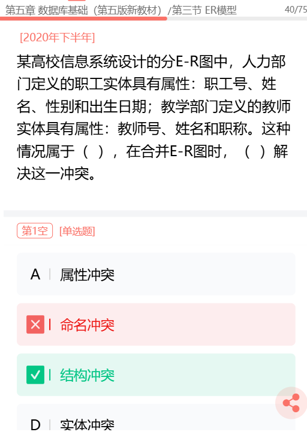

# E-R 冲突类型

---

> 没有实体冲突的说法。

## 属性冲突

属性的类型、取值范围和数据单位等可能会不一致。
(产生这种冲突的原因：同一属性可能会存在于不同的分E-R图，由于设计人员不同或是出发点不同)

## 命名冲突

相同意义的属性在不同的分E-R图中有着不同的命名，或是名词相同的属性在不同的分E-R图中代表这不同的意义。

## 结构冲突

同一实体在不同的分E-R图中有不同的属性（**属性集合的个数不同**），**或者**同一对象在某一分E-R图中被抽象为实体，而在另一分E-R图中又被抽象为属性，需要统一。本题属于结构冲突
