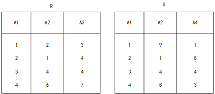

# 关系代数

## 自然连接与笛卡尔积

### 📖 题目

给定关系 **R(A, B, C, D)** 和 **S(A, D, E, F)**，

(52) 若对这两个关系进行自然连接运算 **R ⋈ S**，则连接后的属性列有多少个？

(53) 关系代数表达式 **σ(R.B > S.F)(R ⋈ S)** 等价于哪一个表达式？

### ✅ 答案

- (52) **6 个属性列**
  - 计算方式：
    - R 的 4 列 + S 的 4 列 – 公共 2 列（A, D）= 6 列
- (53) 等价表达式：

```
π1,2,3,4,7,8 ( σ(1=5 ∧ 2>8 ∧ 4=6)(R × S) )
```

## 📌 π —— 投影 (Projection)

- **作用**：从关系中**选择列**。
- **意义**：决定输出哪些属性（列），去掉不需要的列。
- **类比 SQL**：`SELECT column1, column2, ...`

## 📌 σ —— 选择 (Selection) 

- **作用**：从关系中**过滤行**。
- **意义**：筛选满足条件的元组（行），相当于条件过滤。
- **类比 SQL**：`WHERE 条件`

---

[2020年软件设计师考试上午真题（专业解析+参考答案）.html#第-44-题](https://ebook.qicoder.com/%E8%BD%AF%E4%BB%B6%E8%AE%BE%E8%AE%A1%E5%B8%88/notes/2020%E5%B9%B4%E8%BD%AF%E4%BB%B6%E8%AE%BE%E8%AE%A1%E5%B8%88%E8%80%83%E8%AF%95%E4%B8%8A%E5%8D%88%E7%9C%9F%E9%A2%98%EF%BC%88%E4%B8%93%E4%B8%9A%E8%A7%A3%E6%9E%90+%E5%8F%82%E8%80%83%E7%AD%94%E6%A1%88%EF%BC%89.html#%E7%AC%AC-44-%E9%A2%98)

关系R、S如下表所示，R⋈S的结果集为（ ），R、S的左外联接、右外联接和完全外联接的元组个数分别为（ ）。



> - (A) { (2,1,4),(3,4,4)}
> - (B) { (2,1,4,8),(3,4,4,4)}
> - (C) { (C,1.4.2,1.8).(3.4.4.3,4,4)}
> - (D) { (1,2,3,1,9,1),(2,1,4,2,1,8),(3,4,4,3,4,4).(4,6,7.4,8,3)}
>
> - (A) 2,2,4
> - (B) 2,2,6
> - (C) 4,4,4
> - (D) 4,4,6

✅ **完全外连接 = 左连接 UNION 右连接, 最后去重**

🧠 标准写法（数据库原生支持 FULL OUTER JOIN）

```sql
SELECT
    A.id AS A_id,
    A.name AS A_name,
    B.id AS B_id,
    B.name AS B_name
FROM
    A
FULL OUTER JOIN
    B
ON
    A.id = B.id;
```

等价于 **左外 + 右外 + UNION 去重**

```sql
SELECT A.id, A.name, B.id, B.name
FROM A
LEFT JOIN B ON A.id = B.id

UNION

SELECT A.id, A.name, B.id, B.name
FROM A
RIGHT JOIN B ON A.id = B.id;
```

## 🧠 为什么 LEFT OUTER JOIN 里要写 OUTER（虽然可以省略）？

- SQL 标准里规定的完整写法是：

  ```
  LEFT OUTER JOIN
  RIGHT OUTER JOIN
  FULL OUTER JOIN
  ```

但对 **LEFT / RIGHT** 来说，`OUTER` **只是语法糖（装饰词）**，为了**表示这是一种外连接（Outer Join）而不是内连接（Inner Join）**。
