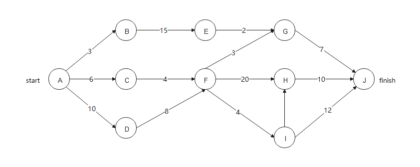
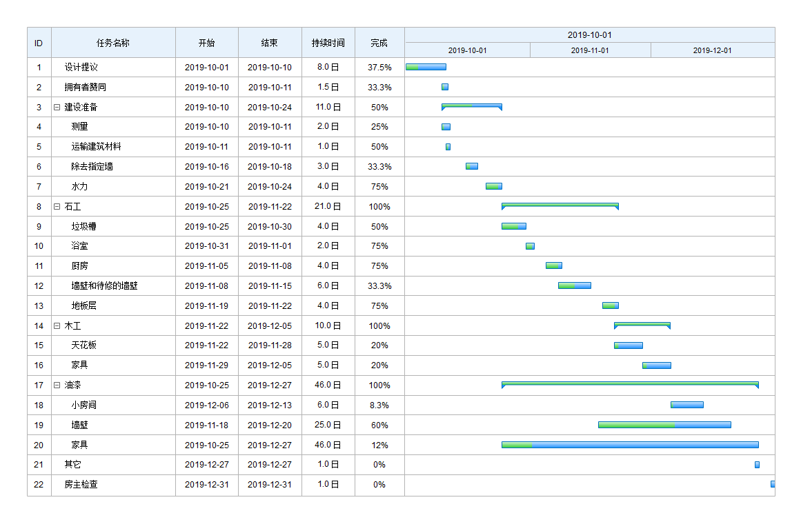

# Gant图与Pert图

> PERT图和甘特图（Gantt图）都是项目管理中非常常用的工具，可以用来描述项目进度

## Pert图

1. 描述各个任务的先后顺序

2. 能清晰地描述子任务之间的依赖关系

3. 标明每项活动的时间或相关的成本

4. **不能**直接**反映**项目的**实际进度**

---

## 甘特图

1. 能清晰地描述每个任务从什么时候开始，到什么时候结束

2. 能清晰表示任务之间的并行关系

3. 但它不能清晰地反应出任务之间的依赖关系

---

 

## 参考

[PERT图 VS 甘特图（Gantt图）](https://www.zhihu.com/tardis/zm/art/377183621?source_id=1003)
