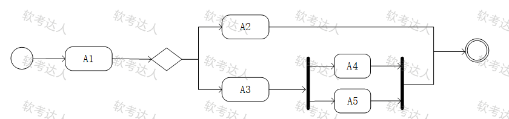
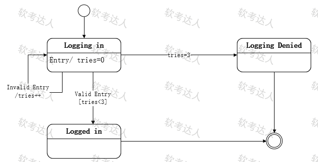

# UML图

## 对象图

> 展现了某一个时刻一组对象以及它们之间的关系。

## 类图

> 展现了一组对象、接口、协作和它们之间的关系。

## 用例图

> 展现了一组用例、参与者以及它们之间的关系。

## 序列图

> 是场景的图形化表示，描述了以时间顺序组织的对象之间的交互活动。 

## 活动图
> 系统内从一个活动到另一个活动的流程

### 特点

有加粗的黑色竖条，表示并发分岔

A1之后，可能的活动是A2或者A3、A4和A5, 即A1之后，要么执行A2或者A3,如果执行A3,那一定还会执行A4和A5

## 状态图

> 

### 特点

带箭头的直线上有转换的条件

监护条件：监护表达式，就是指某种动作出发前的条件。 如监护条件是 `tries < 3`

转换后的效果：如`tries++`

