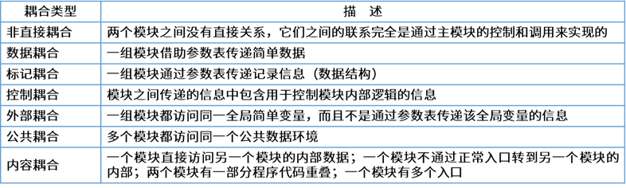
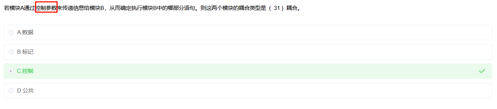

# 耦合性：费书记控制外部公共内容

[图片引用出处 https://ebook.qicoder.com/%E8%BD%AF%E4%BB%B6%E8%AE%BE%E8%AE%A1%E5%B8%88/notes/2021%E5%B9%B4%E4%B8%8A%E5%8D%8A%E5%B9%B4%E8%BD%AF%E8%AE%BE%E8%80%83%E8%AF%95%E4%B8%8A%E5%8D%88%E7%9C%9F%E9%A2%98.html?h=%E7%80%91%E5%B8%83%E6%A8%A1%E5%9E%8B#%E7%AC%AC-27-%E9%A2%98](https://ebook.qicoder.com/%E8%BD%AF%E4%BB%B6%E8%AE%BE%E8%AE%A1%E5%B8%88/notes/2021%E5%B9%B4%E4%B8%8A%E5%8D%8A%E5%B9%B4%E8%BD%AF%E8%AE%BE%E8%80%83%E8%AF%95%E4%B8%8A%E5%8D%88%E7%9C%9F%E9%A2%98.html?h=%E7%80%91%E5%B8%83%E6%A8%A1%E5%9E%8B#%E7%AC%AC-27-%E9%A2%98)

---

## 耦合度的层次

> 特别注意： **控制参数≠数据**

耦合度从低到高（也就是从好到坏）大致可以分为以下几个等级：

1. **非直接耦合**：两个模块完全独立，没有关联，没法一起完成系统功能。因为系统需要模块之间协作，所以不是最佳
2. **数据耦合**：模块间通过**控制参数**传递**简单数据项**。（**最理想**）
3. **标记耦合**：模块间通过传递**复杂数据结构**（如对象或数组）。
4. **控制耦合**：一个模块通过传递**控制信息**（一个**标志**或一个**状态值**）来影响另一个模块的执行路径。
5. **外部耦合**：两个模块都访问一个**共享的外部数据区域**（如文件或数据库）。
6. **公共耦合**：两个模块都访问一个**全局的共享**数据区。
7. **内容耦合**：一个模块直接访问另一个模块的**内部数据**或**修改其代码**。（**最糟糕**）

## 根据场景选择对应的耦合性

---

