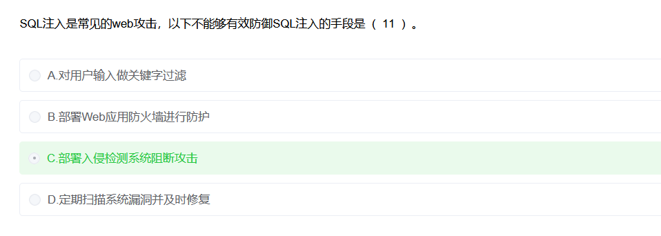

# SQL注入

🔍 逐个分析

- **A. 对用户输入做关键字过滤** ✅ 有效
   → 常见做法，比如过滤掉 `' OR 1=1 --` 这样的注入片段。
- **B. 部署 Web 应用防火墙拦截防护** ✅ 有效
   → WAF 可以检测 SQL 注入模式并阻断请求。
- **C. 部署入侵检测系统阻断攻击** ❌ 不能有效防御
   → IDS（入侵检测系统）是用来监控、报警的，**不是实时阻断**。
   → IDS要阻断需要 IPS（入侵防御系统）。
- **D. 定期扫描系统漏洞并及时修复** ✅ 有效
   → 漏洞修补能从源头降低 SQL 注入的风险。
