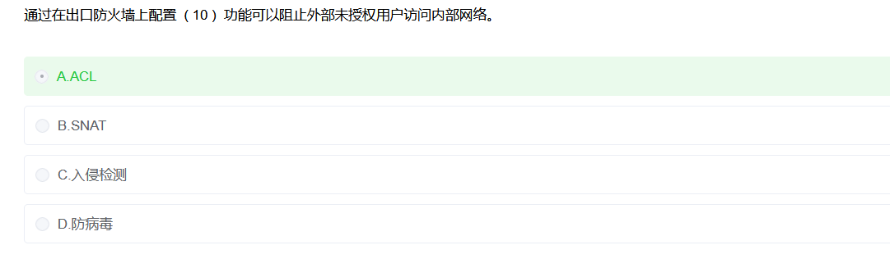

# 防火墙

### 🔍 选项分析

- **A. ACL（访问控制列表）** ✅ 正确
  - ACL 可以设置规则，允许/拒绝特定源地址、目的地址、端口的访问请求。
  - 在防火墙上配置 ACL，就能有效阻止外部未授权用户进入内部网络。
- **B. SNAT（源地址转换）** ❌
  - 主要用于内网主机通过公网访问时修改源地址，不是用来做访问控制的。
- **C. 入侵检测（IDS）** ❌
  - IDS 是监控、告警，不是防火墙直接阻止机制。
- **D. 防病毒** ❌
  - 针对病毒木马，并不是防火墙的核心功能。

---

## 🔥 防火墙类型总结（软考常考）

### 1️⃣ 包过滤防火墙（Packet Filtering）

> 最简单的一种防火墙

- **层次**：网络层（IP、端口）
- **工作方式**：基于 **ACL**，按源/目的 IP、端口、协议放行或丢弃数据包。
- **优点**：效率高、性能好、成本低。
- **缺点**：不能识别**应用层攻击（如 SQL 注入）**。
- **举例**：Linux **iptables**，Cisco 路由器 ACL。

------

### 2️⃣ 状态检测防火墙（Stateful Inspection）

- **层次**：网络层 + 传输层。
- **工作方式**：跟踪连接状态（如 TCP 三次握手），只允许合法会话的数据包通过。
- **优点**：比包过滤更安全，可防御伪造包。
- **缺点**：仍然无法识别应用层攻击。
- **举例**：Checkpoint Firewall-1，Cisco ASA。

------

### 3️⃣ 应用代理防火墙（Application Proxy / 应用层网关）

- **层次**：应用层。
- **工作方式**：防火墙作为代理服务器，中间人转发请求并检查应用数据。
- **优点**：能深入检查应用层协议（HTTP、FTP），安全性高。
- **缺点**：效率低，只能代理特定应用。
- **举例**：Squid（HTTP 代理）、蓝盾安全代理。

------

### 4️⃣ 电路级网关（Circuit-Level Gateway）

- **层次**：会话层。
- **工作方式**：控制 TCP/UDP 会话是否建立，但不检查数据内容。
- **优点**：能隐藏内部网络，性能优于应用代理。
- **缺点**：不能过滤具体应用数据。
- **举例**：**SOCKS 代理**。

------

### 5️⃣ 下一代防火墙（NGFW, Next Generation Firewall）

- **层次**：网络层 → 应用层全覆盖。
- **工作方式**：结合包过滤、状态检测、应用识别、入侵防御（IPS）、深度包检测（DPI）。
- **优点**：安全性最高，能识别应用流量（比如微信、抖音）、防御高级攻击。
- **缺点**：复杂、成本高。
- **举例**：Palo Alto NGFW，华为 USG 系列，Fortinet。

------

## 📌 一句话速记

- **包过滤**：只看门牌号（IP/端口）。
- **状态检测**：看你有没有正经“进门手续”。
- **应用代理**：像保安翻你包，逐件检查。
- **电路网关**：只看你是不是熟人，放行但不翻包。
- **下一代防火墙**：门禁 + 保安 + X 光机 + 人脸识别，全套安检。