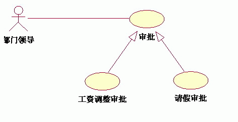
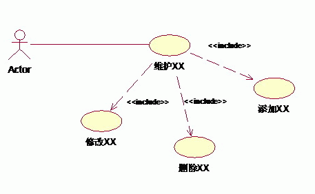

# 三种关系：泛化、包含、扩展

> 共性：都是从现有的用例中抽取出公共的那部分信息，作为一个单独的用例，然后通后过不同的方法来重用这个公共的用例，以减少模型维护的工作量。

## 泛化(generalization)

> **泛化**表示一种**一般与特殊**的关系，用于**父用例与子用例**之间。
>  父用例描述共同的、通用的行为，子用例继承父用例的功能，并可**进行扩展或重写**，体现出更具体的行为。

### 🧩 图的内容

- **参与者（Actor）**：部门领导
- **基础用例（Base Use Case）**：审批
- **扩展用例（Extension Use Case）**：
  - 工资调整审批
  - 请假审批

图中使用了 `<<extend>>` 关系，从 **工资调整审批** 和 **请假审批** 指向 **审批**。

------

### ✅ UML 语义分析

`<<extend>>` 表示：

> 某个用例（扩展用例）在特定条件下扩展了另一个基础用例的行为。
>  也就是说，基础用例定义了一个“可扩展点”，扩展用例在特定场景下填充进去。

所以：

- “审批” 是一个通用行为；
- “工资调整审批”和“请假审批”是它的两种**具体扩展场景**；
- 当不同业务条件出现时，会触发不同的扩展版本。

这就相当于：

> “审批”是一个通用模板，
>  不同业务（工资调整、请假）扩展它的逻辑。

------

### 📘 UML 方向说明

> 在 UML 中，`<<extend>>` 的箭头应从 **扩展用例 → 被扩展用例(基础用例)**。

### 💡 对比说明

| 用例关系      | 场景                       | 触发条件   | 语义                 |
| ------------- | -------------------------- | ---------- | -------------------- |
| `<<include>>` | 主用例复用子用例的公共行为 | 总是执行   | 被包含用例是必需部分 |
| `<<extend>>`  | 扩展主用例的变体行为       | 条件性触发 | 扩展用例是可选部分   |

## 包含(include)

> **包含**关系表示一个用例在执行过程中**必定会调用另一个用例的完整行为**，体现的是一种功能**复用**的关系。**被包含的用例**通常**是**一个可以被多个用例**共享的**、**通用的子功能**。

### 🧩 图中结构

- **参与者（Actor）**：Actor（一般指用户或系统外部角色）
- **主用例**：维护XX
- **被包含的用例**：添加XX、修改XX、删除XX
- 关系：
  - 维护XX → 添加XX （`<<include>>`）
  - 维护XX → 修改XX （`<<include>>`）
  - 维护XX → 删除XX （`<<include>>`）

------

### ✅ UML 语义解释

`<<include>>` 表示：

> 一个用例 **必然包含** 另一个用例的行为。
>  换句话说，被包含的用例是 **共用的、不可或缺的子功能**。

也就是说：

- “维护XX” 是一个**复合用例**；
- 它的完整执行流程 **必定包含** 添加、修改、删除 三种操作；
- 每一种操作（添加、修改、删除）可能在不同情景下被执行，但从逻辑上都是“维护”的一部分。

------

### 📘 UML 方向说明

`<<include>>` 的箭头方向是：
 👉 从 **基础用例** 指向 **被包含的用例**。

即：

> “维护XX” 包含 “添加XX”
>  因此箭头从“维护XX” → “添加XX”

| 项目       | 含义                                               |
| ---------- | -------------------------------------------------- |
| 主用例     | 维护XX（更高层次的功能）                           |
| 被包含用例 | 添加、修改、删除XX                                 |
| 关系       | include 表示这些子操作是“维护XX”不可分割的组成部分 |
| 箭头方向   | 从维护XX → 添加/修改/删除XX                        |

比如银行取款的事件流中，**创建会话**包含**存款**、**取款**、**转账**、**查询**等**子功能**

## 扩展(extend)

>**扩展**表示一种**可选的、条件触发的关系**。
> 一个用例（扩展用例）在特定条件下，**扩展另一个基本用例（基础用例）** 的行为, **扩展用例是可选的，不是必然发生**的
>
>白话文：执行一个用例的时候，在某种特定情况下，可能发生的行为，这个可能发生的行为就是扩展用例
>
>比如，取款的时候，要输入验证码，**验证码输入错误**是一种**可能发生**的事情，验证码输入错误的时候要执行**验证码错误处理**的用例. 此时**取款**用例**扩展验证码错误处理**的用例

### 🧩 图中内容

- **参与者（Actor）**：员工
- **基本用例（Use Case）**：执行查询
- **扩展用例（Extend Use Case）**：导出查询结果、打印查询结果

关系：

- “导出查询结果” <<extend>> “执行查询”
- “打印查询结果” <<extend>> “执行查询”

------

### ✅ 含义解析

`<<extend>>` 的意思是：

> 扩展用例在**某种条件下**可以扩展基础用例的行为，但**不是必须的**。

也就是说：

- “执行查询”是主流程；
- 当用户执行查询后，**有可能选择**导出或打印结果，这些操作是 **可选的扩展行为**。

### ✅ 更准确的表述方式应该是：

> “导出查询结果”和“打印查询结果”是**对‘执行查询’用例行为的可选扩展**，
>  当系统或用户满足特定条件（例如用户选择导出或打印）时，
>  这些扩展行为才会发生。

| 目的                  | 用法                                  | 箭头方向    |
| --------------------- | ------------------------------------- | ----------- |
| 严格 UML 语义（推荐） | “**异常**/**附加情况**扩展**主流程**” | 扩展 → 基础 |

重点在：

- 扩展用例是“可选”的；
- 它**依附于**基础用例；
- **基础**用例并**不知道扩展的存在**（它不依赖扩展）。

## 参考

- [UML用例图中包含(include)、扩展(extend)和泛化(generalization）三种关系详解](https://www.cnblogs.com/fan0136/archive/2008/12/14/1354730.html)

