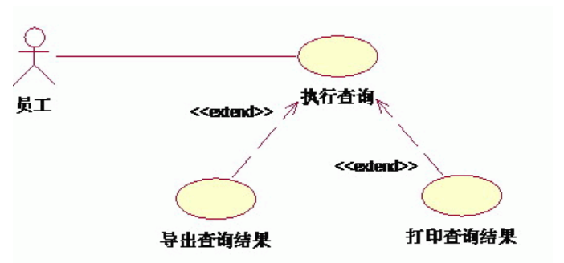

# 三种关系：泛化、包含、扩展

> 共性：都是从现有的用例中抽取出公共的那部分信息，作为一个单独的用例，然后通后过不同的方法来重用这个公共的用例，以减少模型维护的工作量。

## 泛化(generalization)

> **泛化**表示一种**一般与特殊**的关系，用于**父用例与子用例**之间。
>  父用例描述共同的、通用的行为，子用例继承父用例的功能，并可**进行扩展或重写**，体现出更具体的行为。

## 包含(include)

> **包含**关系表示一个用例在执行过程中**必定会调用另一个用例的完整行为**，体现的是一种功能**复用**的关系。**被包含的用例**通常**是**一个可以被多个用例**共享的**、**通用的子功能**。

比如银行取款的事件流中，**创建会话**包含**存款**、**取款**、**转账**、**查询**等**子功能**

## 扩展(extend)

>**扩展**表示一种**可选的、条件触发的关系**。
> 一个用例（扩展用例）在特定条件下，**扩展另一个基本用例（基础用例）** 的行为, **扩展用例是可选的，不是必然发生**的
>
>白话文：执行一个用例的时候，在某种特定情况下，可能发生的行为，这个可能发生的行为就是扩展用例
>
>比如，取款的时候，要输入验证码，**验证码输入错误**是一种**可能发生**的事情，验证码输入错误的时候要执行**验证码错误处理**的用例. 此时**取款**用例**扩展验证码错误处理**的用例

### 🧩 图中内容

- **参与者（Actor）**：员工
- **基本用例（Use Case）**：执行查询
- **扩展用例（Extend Use Case）**：导出查询结果、打印查询结果

关系：

- “导出查询结果” <<extend>> “执行查询”
- “打印查询结果” <<extend>> “执行查询”

------

### ✅ 含义解析

`<<extend>>` 的意思是：

> 扩展用例在某种条件下可以扩展基础用例的行为，但不是必须的。

也就是说：

- “执行查询”是主流程；
- 当用户执行查询后，**有可能选择**导出或打印结果，这些操作是 **可选的扩展行为**。

换句话说：

- 员工首先“执行查询”；
- 查询完成后，可以 **选择** “导出结果” 或 “打印结果”。
   这些都 **建立在执行查询成功** 的前提下。

## 参考

- [UML用例图中包含(include)、扩展(extend)和泛化(generalization）三种关系详解](https://www.cnblogs.com/fan0136/archive/2008/12/14/1354730.html)

