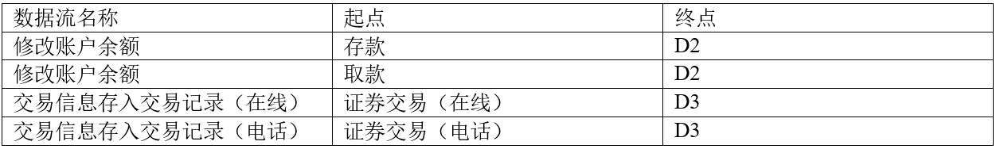

# 数据流图答题规范

## 给出图1-1中的实体E1-E3的名称

```
E1：客户服务助理，E2：客户，E3：经纪人
```

---

## 给出图1-2中的数据存储D1-D3的名称。

D1：客户记录，D2：账户记录，D3：交易记录

---

## 结构化语言对加工逻辑进行描述(3分)

2021年上半年下午题

(5)道闸控制。根据道闸控制请求向道闸控制系统发送放行指令和接收道闸执行状态。

若道闸执行状态为正常放行时，对入场车辆，将车牌号及其入场时间信息存入停车记录，修

改空余车位数；对出场车辆更新停车状态，修改空余车位数。当因道闸重置系统出现问题（断

网断电或是故障为抬杠等情况），而无法在规定的时间内接收到其返回的执行状态正常放行

时，系统向管理人员发送异常告警信息，之后管理人员安排故障排查处理，确保车辆有序出

入停车场。

3分：根据说明，采用结构化语言对“道闸控制”的加工逻辑进行描述。

解答：

收到道闸控制请求

**IF** 道闸执行状态为正常放行时

​	**THEN**

​	**IF** 入场车辆

​		**THEN** 将车牌号机器入场信息存入停车记录，修改空余车位数

​	**ELSE**

​		更新停车状态，修改空余车位

​	**ENDIF**

**ELSE**

​	向管理员发送异常告警信息

**ENDIF**

---

## 缺失的数据流答题规范

补充以下数据流：


---

---

### 给出实体名称

第一道大题找实体E1到En
实体的特点是: 主语, 名词, 找实体就是找名词

#### 结合数据流和加工来看,描述一般是, 某一个**加工**接收**XXX**的数据,举例


解析: 数据接收这个加工接收到了充电数据, 接收, 是指数据流流入, 既然接收的是**计量装置**的数据,那么E1就是**计量装置**

---

#### 向XXX发出/发送什么, XXX接收了什么, 结合子图,得到XXX就是对应的实体,举例


---

#### XXX根据什么做了什么,这里的XXX就是实体,如下


### 给出数据存储的名称

#### 关键词, **信息** / **文件** / **表** , 发现这类关键词的时候, 表示当前的存储名称以这些关键字结尾


---


#### 没有关键字出现的时候, 可以不写关键字后缀,也可以加后缀 表


---

