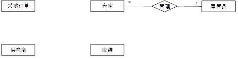
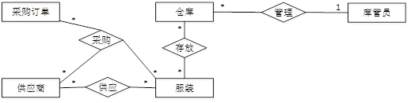

# 经典题型-数据库设计

## 201105-本应该拿满分，但是有特别容易丢分的地方

【说明】
      某服装销售公司拟开发一套服装采购管理系统，以便对服装采购和库存进行管理。
    【需求分析】
       （1）采购系统需要维护服装信息及服装在仓库中的存放情况。服装信息主要包括：服装编码、服装描述、服装类型、销售价格、尺码和面料，其中，服装类型为销售分类，服装按销售分类编码。仓库信息包括：仓库编码、仓库位置、仓库容量和库管员。系统记录库管员的库管员编码、姓名和级别。一个库管员可以管理多个仓库，每个仓库有一名库管员。一个仓库中可以存放多类服装，一类服装可能存放在多个仓库中。
       （2）当库管员发现有一类或者多类服装缺货时，需要生成采购订单。一个采购订单可以包含多类服装。每类服装可由多个不同的供应商供应，但具有相同的服装编码。采购订单主要记录订单编码、订货日期和应到货日期，并详细记录所采购的每类服装的数量、采购价格和对应的多个供应商。
       （3）系统需记录每类服装的各个供应商信息和供应情况。供应商信息包括：供应商编码、供应商名称、地址、企业法人和联系电话。供应情况记录供应商所供应服装的服装类型和服装质量等级。一个供应商可以供应多类服装，一类服装可由多个供应商供应。库管员根据入库时的服装质量情况，设定或修改每个供应商所供应的每类服装的服装质量等级，作为后续采购服装时，选择供应商的参考标准。
    【概念模型设计】
      根据需求阶段收集的信息，设计的实体联系图（不完整）如图2-1所示。

​    【逻辑结构设计】
​    根据概念模型设计阶段完成的实体联系图，得出如下关系模式（不完整）：
​    库管员（库管员编码，姓名，级别）
​    仓库信息( (1)  ，仓库位置，仓库容量）
​    服装（服装编码，服装描述，服装类型，尺码，面料，销售价格）
​    供应商（供应商编码，供应商名称，地址，联系电话，企业法人）
​    供应情况(  (2)  ，服装质量等级）
​    采购订单( (3)  )
​    采购订单明细(____(4)  )

​    【问题1】（6分）
​      根据需求分析的描述，补充图2.1中的联系和联系的类型。
​    【问题2】（6分）
​      根据补充完整的图2-1，将逻辑结构设计阶段生成的关系模式中的空(1)～(4)补充完整，并给出其主键（用下划线指出）。
​    【问题3】（3分）
​      如果库管员定期需要轮流对所有仓库中的服装质量进行抽查，对每个仓库中的每一类被抽查服装需要记录一条抽查结果，并且需要记录抽查的时间和负责抽查的库管员。请根据该要求，对图2-1进行修改，画出修改后的实体间联系和联系的类型。

---

### 参考答案

【问题1】（6分）  ‘
  （联系各1分，联系的类型各1分）非常**容易踩坑的地方**：少了**供应**关系，供应在问题2出现过的，要补充到联系图

 【问题2】 (6分)
  （每个空1分，主键各0.5分） **题目只要求画出主键，没说外键**，所以不用管外键，多做可能扣分
  (1)仓库编码，库管员编码  主键：仓库编码
  (2)供应商编码，服装编码   主键：供应商编码，服装编码
  (3)订单编码，订货日期，应到货日期  主键：订单编码
  (4)订单编码，服装编码，供应商编码，数量，采购价格  主键：订单编码，服装编码，供应商编码
  【问题3】 (3分)
  （联系“抽查”2分，联系的类型1分） 题目要求画出，所以只需要画图补充联系即可。不需要写。 机考的时候估计也没地方写。需要注意的是，需要把问题2补充上的联系图再画一次，也就是最后给的是2和3题的完整的联系图。。。。所以2要认真做，如果2做的不全，不知道3空会不会继续扣分

---

---

## 总结

分为两步：

1. 做题

   1. 关系模式填空与联系图相互结合着看，彼此中有答案
   2. 抄题干填空：把非常明确的并且缺少的属性先加进来

2. 检查

   1. 每一个关系模式都要在联系图中体现

   2. 拿着问题1的每一个关系模式的主键去排查剩下的每一个关系模式和联系图，看当前关系模式的主键是否需要添加到其他的关系模式中
   3. 给出一段描述，可能需要添加新的实体，也可能不需要。如果需要新增实体，按题目要求，有些只需要画出来，有些需要写出来新的关系模式。 这里有个技巧，画图用以疏忽，所以无论如何都把关系模式写到纸上，然后把每个关系在联系图中体现出来

