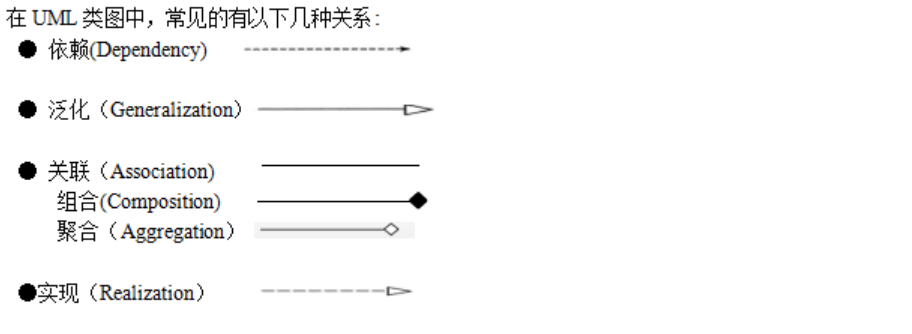

# 综合

## 内聚类型

## 并发进程竞争资源

## 图

## 浮点数

## 统一过程模型RUP

起始阶段：起始阶段专注于项目的**初创**活动。

精化阶段：精化阶段在理解了最初的领域范围之后进行**需求分析和架构演进**。

构建阶段：构建阶段关注系统的构建，产生实现模型。

移交阶段：移交阶段关注于**软件提交**方面的工作，**产生软件增量**

## 白盒测试

（1）程序模块中的所有独立路径至少执行一次

（2）在所有的逻辑判断中，取“真”和取“假”的两种情况至少都能执行一次

（3）每个循环都应在边界条件和一般条件下各执行一次

（4）测试程序内部数据结构的有效性等

## 对面向对象软件的测试

（1）算法层：测试类中定义的每个方法。

（2）类层：测试封装在同一个类中的所有方法与属性之间的相互作用。

（3）模板层：测试一组协同工作的类之间的相互作用。

（4）系统层：把各个子系统组装成完整的面向对象软件系统，在组装过程中同时进行测试

## 上下文无关文法

---

---

---

---

---

---

---

---

---

---

---

---

---

---

---

---

---

---

---

#### 奇偶校验码

只校验，不纠错。 只有奇数个数据位发生错误，才会发现错误

#### 循环冗余校验码

模2运算来构造校验位

---

#### 海明码

- 码距必须要大于1
- 码距等于2，只能校验错误，不能就错误
- 码距>=3, 校验错误+纠错

---

## 攻击

### 主动攻击

> 主动攻击的目的是**破坏系统完整性、可用性或真实性**，攻击者直接对数据或系统进行篡改或干扰。

1. **篡改（Tampering）**
   - 修改传输或存储中的数据。例如：篡改HTTP请求参数以获取未授权数据。
2. **伪装（Masquerade）**
   - 冒充合法用户或实体进行攻击。例如：伪造发件人地址发送钓鱼邮件。
3. **重放攻击（Replay Attack）**
   - 截获合法通信后重复发送，以欺骗系统。例如：重复提交已捕获的登录凭证。
4. **拒绝服务攻击（DoS/DDoS）**
   - 通过大量请求耗尽系统资源，导致服务瘫痪。例如：SYN洪水攻击。
5. **中间人攻击（MITM, Man-in-the-Middle）**
   - 攻击者插入通信链路，窃听或篡改数据。例如：伪造WiFi热点截取用户信息。
6. **恶意代码（Malware）**
   - 植入病毒、蠕虫、木马等破坏系统或窃取数据。
7. **SQL注入/XSS攻击**
   - 通过注入恶意代码操纵数据库或劫持用户会话（属于应用层主动攻击）

### 被动拦截

> 被动攻击的目的是**非法获取信息**，但不直接破坏系统或数据。攻击者通常隐蔽进行，难以被发现。

1. **窃听（Eavesdropping）**
   - 通过监听网络流量获取敏感信息（如密码、明文传输的数据）。
   - 例如：使用抓包工具（如Wireshark）截取未加密的HTTP通信。
2. **流量分析（Traffic Analysis）**
   - 分析通信模式（如频率、时间、数据量等）推断信息，即使数据已加密。
   - 例如：通过分析某服务器的流量峰值，推测其业务活动。
3. **信息收集（Information Gathering）**
   - 收集系统公开信息（如IP地址、端口、软件版本等），为后续攻击做准备。

- **被动攻击防御**：加密技术（如HTTPS、VPN）、最小化敏感信息暴露。
- **主动攻击防御**：防火墙、入侵检测系统（IDS）、数字签名、输入验证等。

---

---

---

---

---

---

---

- 撞库：使用大量的一个网站的账号密码，去另一个网站尝试登陆。也就是基于用户代码重复度比较高的问题，使用被脱库的密码尝试其它网站。

- 洗库：黑客入侵网站在取得大量的用户数据之后，通过一系列的技术手段和黑色产业链将有价值的用户数据变现。

- 社工库：黑客将获取的各种数据库关联起来，对用户进行全方位画像。

---

SMTP和POP3都是基于TCP的协议，提供可靠的邮件通信

- 常用协议端口号情况如下：

- POP3：TCP的110端口，邮件收取。

- SMTP：TCP的25端口，邮件发送。

- FTP：TCP的20数据端口/21控制端口，文件传输协议。

- HTTP：TCP的80端口，超文本传输协议，网页传输。

- DHCP：UDP的67端口，IP地址自动分配。

- SNMP：UDP的161端口，简单网络管理协议。

- DNS：UDP的53端口，域名解析协议，记录域名与IP的映射关系。

---

OSI参考模型表示层的功能有数据解密与加密、压缩、格式转换等

VLANtag在OSI参考模型的**数据链路层**实现。

以太网交换机属于网络模型中(**数据链路层**)，管理的是(**帧**)

FTP协议占用两个标准的端口号：20和21，其中20为数据口(上传文件)，21为控制口。

POP3 协议默认端口： **110**.默认传输协议： **TCP**

无线wlan主要采用的是IEEE802.11标准。

---

---

---

机房安全属于物理安全，入侵检测属于网络安全，漏洞补丁管理属于系统安全，而数据库安全则是应用安全

---

---

## UML

---

## 主动攻击

- 拒绝服务攻击
- 分布式拒绝服务（DDos）
- 信息篡改
- 资源使用
- 欺骗
- 伪装
- 重放

- 会话拦截

- 修改数据命令

---

---

---

---

---

---

---

---

**归并排序的递归式**:  T(n) = 2T (n/2) +O(n)

---

- 工厂单例建原型: **创建型模式**,  工厂方法 (**创建型类**)
- 世代外接享组合: **结构性模式**,  适配器模式 **特殊:** **既是**结构型对象模式 ,**也是**结构型类模式
- 剩下的(其他的)都是行为型模式共11个 . 模板方法模式 (**行为型类模式**),解释器模式 (**行为型类模式**)

---

#### 动态规划:

- **0-1背包问题**:  时间复杂度和空间复杂度都是O(NW), N是物品数量,W是背包容量
- **最长公共序列**
- **矩阵连乘**: 时间复杂度是**O(n^3)**, 空间复杂度是**O(n^2)**

---

文档撰写:

1. 测试分析**报告**在测试阶段编写
2. 测试**计划**在需求分析阶段编写
3. **需求规格书**在需求分析阶段编写
4. **概要设计**说明书是在设计阶段编写

---

### 最优解

1. **贪心算法**: 分数(部分)背包
2. 动态规划: 0-1背包/最长公共子序列
3. **暴力搜索**: 旅行商

---

#### 甘特图

1. 能看出每个子任务持续的时间
2. 能看出项目的实际进度
3. **看不出**每个任务的衔接关系

---

具有n个结点的二叉树有 **(2n)!/( (n+1)! * n! )**

---

#### 软件详细设计阶段

- 对**模块内**的**数据结构进行设计**
- 对数据库进行物理设计
- 对每个模块进行详细的算法设计
- 代码设计、输入/输出设计、用户界面设计

---

#### 概要设计阶段

##### 软件系统总体结构设计

1. 将系统划分为模块
2. 确定每个模块的功能
3. 确定模块之间的调用关系
4. 确定模块之间的接口,即模块之间传递的信息
5. 评价模块结构的质量

---

---

---

---

---

- **词法**分析阶段处理的错误：**非法字符**、**单词拼写错误**等
- **语法**分析阶段处理的错误：**标点符号错误**、**表达式中缺少操作数**、**括号不匹配**等有关语言结构上的错误。
- **静态语义**分析阶段（**即语义分析阶段**）处理的错误：**运算符与运算对象类型不合法**等错误。
- **目标代码生成**（执行阶段）处理的错误：**动态语义错误**，包括陷入**死循环**、**变量取零时做除数**、**引用数组元素下标越界等错误**等

---

---

### 概要设计阶段(全局)

- 软件系统**总体结构设计**，将**系统**划**分成模块**
- 确定每个**模块的功能**
- **确定模块之间的调用关系**
- **确定模块之间的接口**，即模块之间传递的信息
- **评价**模块结构的质量
- **数据结构及数据库设计**

---

### 软件详细设计阶段(细节)

- 对**模块内**的**数据结构进行设计**
- 对数据库进行物理设计
- 对每个模块进行详细的算法设计
- 代码设计、输入/输出设计、用户界面设计

---

---

---

---

## 二叉树的存储

1. 二叉树的顺序存储.在采用顺序存储时,完全二叉树与一般二叉树相比节省了空间,这是因为一般二叉树需要添加一些"虚节点"而造成了空间的浪费

---

## 二叉树的性质

1. 在二叉树的**第i层**上最多有**2(i-1) **个结点(i>=1)
2. **深度为k**的二叉树**最多**有**2k-1**个**结点**
3. 任何一个二叉树,如果叶子结点数为n0, 度为2的结点数为n2,  则 **n0 = n2+1**
4. 具有n个结点的完全二叉树的深度为[logn2n] + 1

---

## 满二叉树与完全二叉树

如果一个树的层数为K,结点总数为2^k-1个,则它就是**满二叉树**

在一个深度为h的二叉树中,除第h层(最后一层)外,其他各层都是满的, 并且第h层所有结点都必须从左到右依次放置,**不能留空**,则它就是**完全二叉树**

---

---

---

---

---

---

---

---

---

---

---

Armstrong公理系统

---

---

## 图的存储

有向图和无向图的邻接矩阵与邻接表

---

#### 顺序表

> 基于数组的数据结构实现

1. 可以访问任意下标元素, 通过下标
2. 插入和删除**都需要**移动元素,O(n)

---

---

### 计算机网络协议5层体系结构

- 传输层： 四层交换机 、四层的路由器

- 网络层：三层交换机、路由器

- 数据链路层：网桥、以太网交换机、网卡

- 物理层：中继器、集线器、双绞线

---

### 甘特图

- 能清晰地描述每个任务的**开始和结束**
- 任务的进展情况以及各个任务之间的**并行性**
- **不能清晰地反映**出各任务之间的**依赖关系**
- **难以确定**整个项目的**关键所在**
- **不能反映**计划中**有潜力的部分**

**数据库**的基本表对应概念视图，存储文件对应内部视图，**视图**对应**用户视图**。

在**补码**中0具有唯一编码。将**补码**的**符号位取反**可以得到**移码**。对于数字0来说移码与补码都是唯一的。

定点小数表示中,**只有补码能表示 -1**

在计算机中，最适合进行数字加减运算的数字编码是**补码**，最适合表示浮点数阶码的数字编码是**移码**

### 知识专利

- 双重性：双重性是指知识产权中的独占性与公用性、排他性与共享性、私人性与社会性等多种形式的双重性特征。

- 独占性：是权利人所专有的权利。任何人未经权利人许可,都不得行使其权利(法律另有规定的除外)。

- 地域性：地域性是指知识专利的保护范围通常限于特定的国家或地区。

- 实践性：实践性在这里可以理解为知识技术或专利能够被实际运用或操作的特性。由于知识技术可以同时被多个人使用，这正好体现了其在实际应用中的广泛性和可操作性，即实践性。

