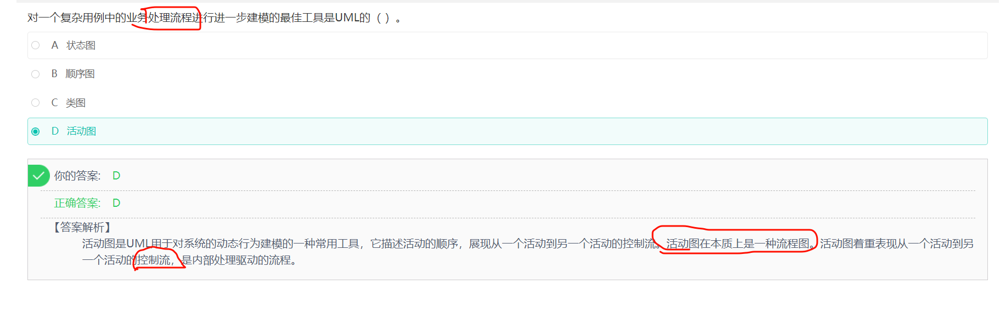

# 综合

## 内聚类型

## 并发进程竞争资源

## 图

## 浮点数

## 统一过程模型RUP

起始阶段：起始阶段专注于项目的**初创**活动。

精化阶段：精化阶段在理解了最初的领域范围之后进行**需求分析和架构演进**。

构建阶段：构建阶段关注系统的构建，产生实现模型。

移交阶段：移交阶段关注于**软件提交**方面的工作，**产生软件增量**

## 白盒测试

（1）程序模块中的所有独立路径至少执行一次

（2）在所有的逻辑判断中，取“真”和取“假”的两种情况至少都能执行一次

（3）每个循环都应在边界条件和一般条件下各执行一次

（4）测试程序内部数据结构的有效性等

## 对面向对象软件的测试

（1）算法层：测试类中定义的每个方法。

（2）类层：测试封装在同一个类中的所有方法与属性之间的相互作用。

（3）模板层：测试一组协同工作的类之间的相互作用。

（4）系统层：把各个子系统组装成完整的面向对象软件系统，在组装过程中同时进行测试

## 上下文无关文法

---

---

---

---

---

